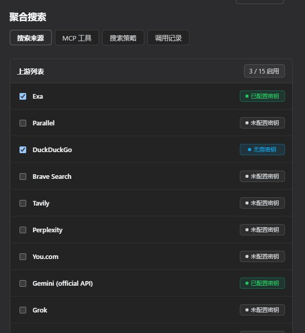
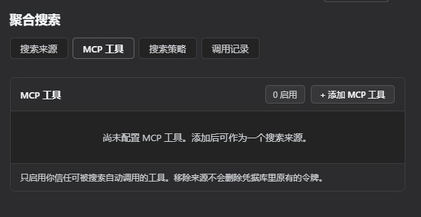
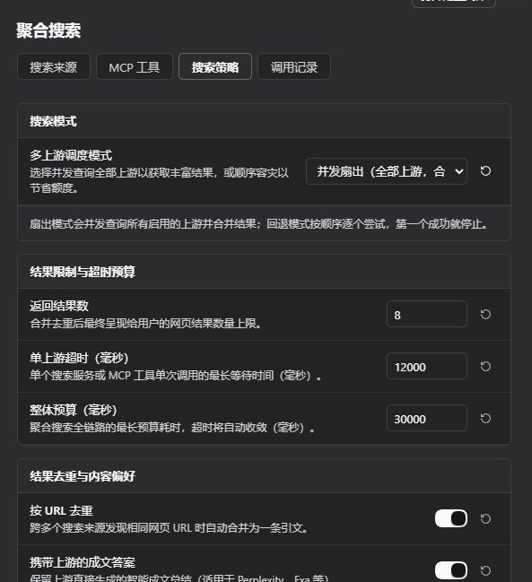
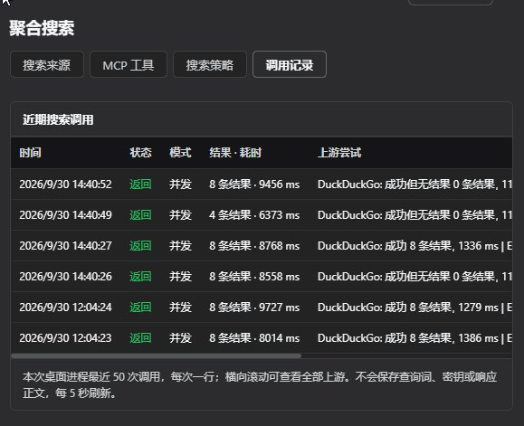

# dsh-agent-web-search

把 [agent-web-search](https://github.com/JerryLiu369/agent-web-search) 的多上游搜索聚合能力，做成一个原生 DSH 插件。

装上之后，**DSH 原生的 `web_search` 工具会改走这个插件的渠道** —— 同一把工具、同一套提示词、同一个引用卡片，底下换成了 15 个内置上游及可添加的多个 HTTP MCP 工具，一次查询可并发扇出、合并、去重。其中三个内置上游**完全不需要 API key**。

## 界面

配置只有一处：**设置 → 聚合搜索**，插件列表里不再重复出现配置表单。页面分四个区。

**搜索来源** —— 15 个内置上游，带启用开关和凭据状态；凭据只显示「已配置 / 未配置」，明文从不回显。



**MCP 工具** —— 挂任意多个 Streamable HTTP MCP 工具当搜索源，可读出工具列表后挑准确名称。



**搜索策略** —— 扇出 / 回退、返回条数、单上游超时、整体预算、按 URL 去重、是否携带成文答案。



**调用记录** —— 最近 50 次调用的时间、状态、真正跑过的上游与耗时。只在内存里，重启即清空。



## 它做了什么

1. **接管 web seam 的搜索位**：`cordis.patch.yml` 把 `web` 行的 `searchProvider` 钉到 `agent-web-search`，并禁用内置的 `web-search-deepseek` 行。不需要改任何 DSH 源码。
2. **只注册一个 provider**：DSH 的规则是「没钉 id 时有多个可用 provider 就抛 `WEB_PROVIDER_AMBIGUOUS`」，所以聚合必须发生在这一个 provider 内部 —— 这正是上游的设计，也符合 seam 的契约。
3. **设置页可实时改**：Config schema 的每个字段都标了 `.volatile()`，改完直接进运行中的引用，**下一次搜索就生效，不用重启**。

## 安装

```bash
dsh plugin --profile <profile> add github:JerryLiu369/agent-web-search
```

**桌面版**：profile 由 Electron 独占，`dsh plugin --profile desktop` 会被 CLI 直接
拒掉（`profile "desktop" is managed exclusively by the Electron application`），
只能手工落盘。四步：

1. 把 `integrations/dsh/` 复制到 `~/.dsh/profiles/desktop/plugins/dsh-agent-web-search/`
   —— **不要带 `node_modules`**。
2. 建软链 `~/.dsh/profiles/desktop/node_modules/dsh-agent-web-search` → `plugins/dsh-agent-web-search`
   （Windows 用 junction，不需提权）。
3. 在 profile 的 `package.json` 里：`dependencies` 加 `file:plugins/dsh-agent-web-search`，
   `dsh.profile.bundles` 加 `dsh-agent-web-search`（**后者才决定装载**）。
4. 重启桌面版，打开**设置 → 聚合搜索**。

> ⚠️ 如果装了 `dsh-codex-subscription`，还要把它那一行的 `searchProvider` 设成 `dsh`。
> 它会在 `apply` 里把用户偏好写回 `web` 行 —— 偏好是 `codex` 时会覆盖本插件的 pin，
> 而且一声不响。

### 为什么必须把 codex 插件的偏好设成 `dsh`（很容易被无声废掉）

`dsh-codex-subscription` 会在 `apply` 里把用户偏好**写回 `web` 行的 `searchProvider`**：

```js
// dsh-codex-subscription/lib/index.js
const provider = selection === "codex" ? CODEX_SEARCH_PROVIDER_ID   // "codex-subscription"
               : selection === "auto"  ? CODEX_AUTO_SEARCH_PROVIDER_ID
               : dshProviderId();        // 读 web 行当前值
if (currentConfig.searchProvider === provider) return;              // 早退
await fiber.update({ ...currentConfig, searchProvider: provider });
```

于是：

- 偏好是 `codex` → 启动时它把 `searchProvider` 改成 `codex-subscription`，
  **本插件的 pin 被覆盖**，`web_search` 又走回 codex。
- 偏好是 `dsh` → 它读出 `web` 行的现值（= 本插件钉的 `agent-web-search`）再写回同一个值，
  **早退，不覆盖**。这才是我们要的：让定义搜索位的那一层说了算。

所以落盘之后要把它设成 `dsh`。如果你之后在 codex 插件的界面里手动切到
`codex` / `auto`，本插件就会被绕过 —— 切回 `dsh` 即可恢复。

> 顺带一个小坑：`dshProviderId()` 读的是 `web` 行的**当前值**，所以在切到
> `auto` 之后再切回 `dsh`，它会把 `codex-subscription-auto` 当成"dsh 的 provider"
> 写回去。这是 codex 插件自身的逻辑，不在本插件范围内；遇到时手工把
> `web` 行的 `searchProvider` 改回 `agent-web-search` 即可。

## 配置：GUI 在哪

配置只注册在 **设置 → 聚合搜索** (`settings.section`)；插件列表不再重复出现配置表单。页面按「搜索来源 / MCP 工具 / 搜索策略 / 调用记录」分区；来源默认收起高级配置，底部集中保存或放弃。该入口通过 `configForms.whileServed` 与 Host 配置服务保持一致。

**界面合同（0.5.0）**：任务顺序为先选来源、再接入 MCP、最后调策略与查看记录；页面沿用 DSH 主题别名，内容宽度上限 920px，分区以细分割线而非多重卡片区分。MCP 的服务地址和可选令牌在最前、发现工具后从列表选准确名称、参数和映射默认收起；每个输入和动作保持不低于 44px 的触控高度，原生按钮、标签与 `details` 保留键盘交互，不加入装饰性动画。日志一次调用一行，窄屏只在日志区横向滚动；错误就地提示并保留已填写的草稿。

页面上能改的东西：

| 控件 | 作用 |
|---|---|
| **搜索模式** | `并发扇出` / `顺序回退`，见下 |
| **返回结果数** | 合并去重后返回多少条（1–20） |
| **单上游超时** | 单个上游的预算，毫秒（1000–60000） |
| **整体预算** | 一次搜索的总预算，毫秒（2000–180000） |
| **按 URL 去重** | 关掉则同一 URL 会被多个上游重复计入 |
| **携带上游的成文答案** | 是否把上游返回的散文答案（Tavily/模型类）带进 `content` |
| **搜索来源** | 紧凑来源卡片：启用、凭据状态、展开后配置端点与密钥 |
| **MCP 工具** | 多个独立的 Streamable HTTP MCP 工具；精确工具名、JSON 参数模板、结果映射及可选 Bearer 令牌 |

密钥**不进设置文件**。它写进凭据库，界面只回读「是否已配置」，明文从不回显。MCP Bearer 凭据引用以来源 id 派生；修改已保存来源的端点会自动分配**新 id/新凭据引用**，旧令牌不会被转发到新服务。需要认证时为新端点重新填写令牌；原来源或修改前的孤立凭据不会自动销毁，请在凭据库单独清理。若新令牌写入失败，配置不会改指到新端点。

### 通用 MCP 工具来源（0.3.0）

在「MCP 工具」点「添加 MCP 工具」：先填 **Streamable HTTP** 端点（远程 HTTPS；本机允许 HTTP localhost/127.0.0.1/::1）与可选 Bearer 令牌，随后点「读取工具列表」选择**准确的工具名**；发现失败时也可手动填写。读取列表无需先保存，只读服务端 `tools/list`、不执行工具；401/403 会提示核对令牌，其余上游错误只回显 HTTP 状态。最后按需展开「高级参数与结果映射」调整 JSON 模板与字段路径，启用后点页底保存。参数示例 `{"query":"{{query}}","limit":"{{maxResults}}"}`：整值 `{{maxResults}}` 是数字，其余模板按字符串替换，可在 JSON 对象中任意嵌套。支持多个独立 MCP 来源；令牌单独写入 DSH 凭据库，不支持 OAuth 或 stdio MCP。

结果模式支持 `structuredContent`、JSON 文本、纯文本答案和自动模式。JSON 模式用 **JSON Pointer** 指定结果数组及每项的 URL/标题/摘要/日期字段，例如 `/data/items` 和 `/link`。仅 HTTP(S) URL 才能成为引用，不能从没有 URL 的文本中凭空生成引用；纯文本答案须在「搜索策略」开启「携带上游的成文答案」。插件先完成 MCP 初始化与 `tools/list` 核对，**只调用你保存的精确工具名**，不模糊匹配、不调用任意其它工具。被选工具本身可能有副作用，因此只配置你信任可被搜索自动调用的工具。每个响应有大小上限，禁止跨域重定向，远端原始错误正文不进入新增的调用记录。

### 查看实际搜索调用

同一设置页的「近期搜索调用」会每 5 秒读取一次本桌面进程内最近 50 次调用，并显示 `web` 当前选中的搜索 provider ID。每次调用严格占表格一行，时间、状态、模式、返回数、总耗时与**真正尝试过的上游**的状态、条数、耗时和可用 HTTP 码同列展示；窄屏在日志区域内横向滚动，页面不横向溢出。`fallback` 未轮到的上游不会伪装成已调用；并发模式缺凭据的上游标「跳过」。

这些记录只在内存中，重启即清空；不保存查询词、API Key、完整 URL、响应正文或原始错误消息。浏览器只通过 Connection 已认证的 `/api/agent-web-search/history` GET 路由读取，不能经未认证的 WebServer 路由访问。**如果 Codex 插件把 `web_search` 切到自身的搜索 provider，本插件完全收不到该次请求，也不会产生记录**；这时空白并不能证明没有发生搜索，请同时检查 Codex 设置中的搜索提供者。

### 两种模式不是一回事

- **并发扇出（fanout，默认）**：所有启用的上游**同时**查询，结果合并去重。同一 URL 被多个上游命中会合并成一行，标题前标记全部命中的来源（例如 `【来源：Exa、DeepSeek】`），并保留 `providers` 提示；成文答案也带来源标记。这让 DSH 最终 `web_search` 结果可直接看到上游，而不必依赖调用记录。MCP 来源用工具名和来源 id 区分，不泄露端点或令牌。
- **顺序回退（fallback）**：按列表顺序逐个试，**第一个返回有效引用或已启用的文本答案即止**；空结果继续尝试后面的上游。便宜、可预测，但未轮到的上游不会运行。

## 支持的上游

| 上游 | 免 key | 说明 |
|---|---|---|
| **Exa** | ✅ | 无 `EXA_API_KEY` 时自动走免费 MCP 端点 `mcp.exa.ai/mcp` |
| **Parallel** | ✅ | 无 `PARALLEL_API_KEY` 时自动走免费 MCP 端点 `search.parallel.ai/mcp` |
| **DuckDuckGo** | ✅ | 直接抓公开 HTML 端点，最脆弱的一个 |
| Brave Search | — | `BRAVE_SEARCH_API_KEY` |
| Tavily | — | `TAVILY_API_KEY`（会返回成文答案） |
| Perplexity | — | `PERPLEXITY_API_KEY` |
| You.com | — | `YDC_API_KEY` |
| Gemini（官方 API） | — | `GEMINI_API_KEY`，Google Search grounding，按 Google 当前模型/档位的免费或付费额度计算 |
| Grok | — | `XAI_API_KEY`，带 X 搜索 |
| Volcengine ARK | — | `ARK_API_KEY` |
| Zhipu Web Search | — | `ZHIPU_WEB_SEARCH_API_KEY` |
| Zhipu Chat Search | — | `ZHIPU_CHAT_SEARCH_API_KEY` |
| DeepSeek | — | `DEEPSEEK_API_KEY`，走 Anthropic 兼容端点 |
| Anthropic Messages（通用） | — | `AGENT_WEB_SEARCH_MESSAGES_API_KEY` |
| OpenAI Responses（通用） | — | `AGENT_WEB_SEARCH_RESPONSES_API_KEY` |
| 自定义 MCP 工具（可添加多个） | 可选 | Streamable HTTP；可选来源专属 Bearer 凭据，不支持 stdio/OAuth |

> ⚠️ 模型联网搜索都消耗对应账号的额度，可能免费，也可能触发计费或配额限制，依服务与账号状态而定。真正无需任何密钥的是前三行。

**默认只开前三个免 key 的**。带密钥的上游默认是**关**的，因为没配 key 的行每次搜索都会失败一次 —— 把它们默认打开，会让"已启用"变成"大概会失败"，页面上一排开着却一个都跑不动。配好凭据后在卡片里一键打开即可。

### 一个凭据可以放多把 key

一个上游只需一个凭据引用，值里可以用 `,` 分隔多把 key，适配器会按轮转挑选 —— 便于摊薄单 key 配额。

## 生效范围与回退

- 装好后 `web_search` 工具**本身没有任何改动**，换的是它背后的 provider。
- **想恢复内置搜索**：把 `cordis.patch.yml` 里 `web-search-deepseek` 那两行删掉，或在 profile 自己的 `cordis.patch.yml` 里写 `disabled: false`（profile 层优先级最高）。
- **同时装了别的 provider 插件**：`searchProvider` 这一行是**整体替换**的，最后应用的那层说了算。多装时把本插件排在 `dsh.profile.bundles` 最后，或者在 profile 自己的层里重新钉一次。
- **装了 Playwright 之类的 fetch 插件**：那个插件的 patch 会连 `searchProvider` 一起重述，可能把搜索位抢回去。此时在 profile 自己的层里把两个键都重钉一次。

## 已知边界

- **seam 只传 `query` 和 `maxResults`**。时间范围、域名过滤、搜索深度在 DSH 侧属于延期工作，塞不进来；需要的话只能改插件内的默认值。
- **免费端点没有公开配额**。Exa / Parallel 免费 MCP 是做引流用的，长跑之前建议先观察一阵。
- **DuckDuckGo 是抓页面**，站方改版就会失效，它对反爬也有反应。它排在两个 JSON 上游后面不是偶然。
  **它也是唯一需要代理的默认上游**：宿主进程若没开 `NODE_USE_ENV_PROXY=1`，它就会
  `fetch failed`。扇出模式容忍单点失败，所以它挂了也不影响 exa + parallel 出结果 ——
  只是少一路交叉验证。想让它稳定工作，就带 `NODE_USE_ENV_PROXY=1` 启动宿主。
- **`fetch` 侧不管**：本插件只管 `web_search`。`fetchProvider` 在 patch 里被重述为 `http`（本机原值）以保证不被抹掉。

## 开发与验证

```
lib/
  defaults.js      两端共享的常量（零 @deepseek-ai 依赖，客户端也要用）
  config.js        schemastery Config —— 这同时就是设置页的来源
  http.js          fetch 封装（超时 / 取消 / JSON-RPC）
  keys.js          key 池解析、掩码、URL 归一化
  engine.js        聚合引擎（扇出 / 回退、合并、去重）
  provider.js      注册进 ctx.web 的那个 provider
  history.js       脱敏且有界的内存调用记录
  index.js         宿主入口和认证读取路由
  client.js        设置页（ModuleLoader 格式，只 require("react")）
  adapters/        16 个内置上游和通用 HTTP MCP 工具
```

从仓库根装依赖再跑。测试全程用内存里的假 MCP HTTP 服务，不碰真实远端：

```bash
npm install
npm test
```

`mcp.test.js` 覆盖握手、工具发现、精确调用、SSE 与结果映射；`client.test.js` 核对只注册设置页以及 MCP 配置保存；`history.test.js` 核对聚合模式、脱敏调用记录。测试不能代替重启 DSH 后的登录态界面验收。

跑 `ddgs` 或任何被墙的端点时记得给代理，且**必须在 shell 里 export**：

```bash
export NODE_USE_ENV_PROXY=1 HTTPS_PROXY=http://127.0.0.1:<代理端口>
```

（`NODE_USE_ENV_PROXY` 只在进程启动时读一次，写在脚本内部不生效。）

## License

MIT。上游 `agent-web-search` 同样以 MIT 发布。
